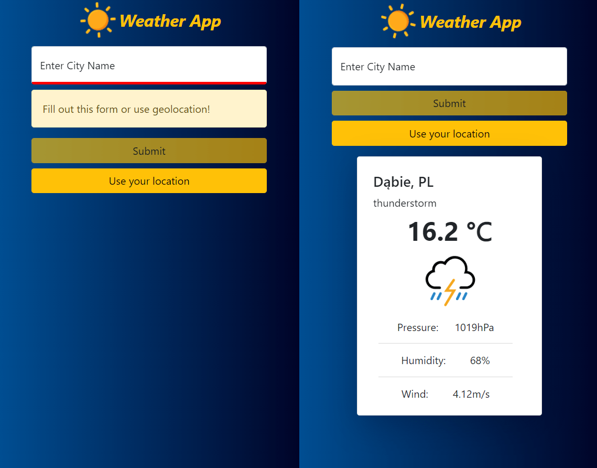

# WeatherApp - Weather Angular App

##### Created with Angular, Bootstrap and OpenWeatherMap Api

## Introduction

My attempt to make an weather app with Angular.
App is conecting with `https://openweathermap.org/` API. 
You have two options to get data from API: 
1. entering city name,
2. sharing your geolocation. 

##### App is responsive

## Built with

Project is created with:

- Angular 11.2.14
- Bootstrap 5.0
- [OpenWeatherMap Api](https://openweathermap.org/)

## Features

- fetching data from [OpenWeatherMap Api](https://openweathermap.org/)
- get weather by City name
- get weather by geolocation
- subtle animation when card appears
- showing current wather with weather icon and some basic data like: temperature, pressure, humidity, wind speed 

## Screenshots

## Launch
To launch this app on your computer you need to get your own API key first from `https://openweathermap.org/`.
Here are steps to create API key: 
1. Navigate to [OpenWeatherMap API website](https://openweathermap.org/).
2. Find the section entitled `Current Weather Data` and click on the Subscribe button.
You'll see the page with available pricing schemes of the service. For this project, use the Free tire.
3. Click on the `Get API key` button.
4. Fill in all the required details on the sign-up page and click on the Create Account button. 
5. Find the confirmation email on your mailbox and `Verify your email` to complete registration. 
6. Shortly you will receive mail from OpenWeather with detail about your current subscription, including your `API key` that you will use to communicate with the API.

Now all you have to to is : 
1. Clone this repo to your desktop.
2. Go to `src\environments` folder and find `environment.example.ts` file. Change it's name for `environment.ts`
3. Inside this file find property `apiKey` and replace it's value `<Your API key>` with the key that you recaived from `OpenWeatherMap Website `.
4. Run `npm install` to install all the dependencies.
5. Run `ng serve` for a dev server. Navigate to `http://localhost:4200/`.

Now you can check the weather in any part of the globe :) 

### Live Demo

## Contact

Created by [@PawelBak](https://pawel-bak-portfolio.web.app/) - feel free to contact me!
